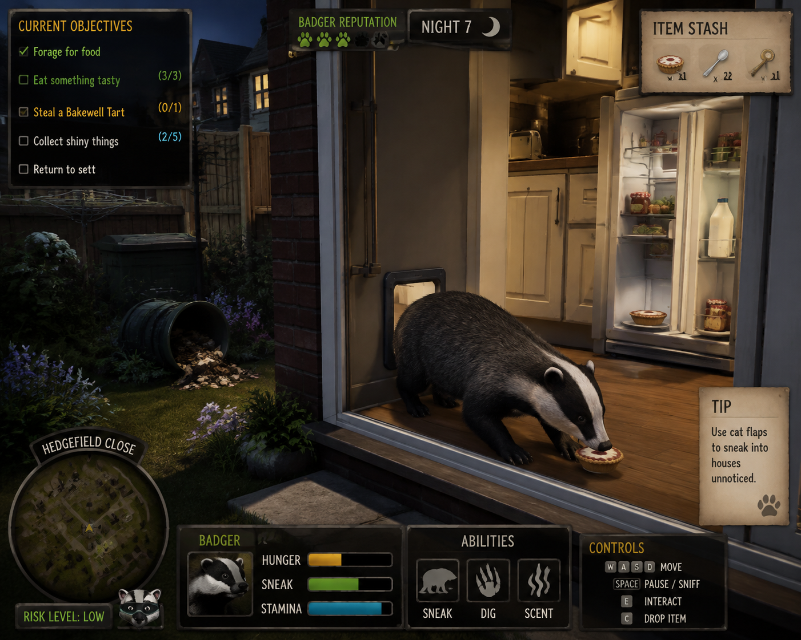

# Badger Blitz

A browser game about being a badger in a British cul-de-sac.

Every night you leave the sett, work the bins and gardens of Hedgefield Close, sneak into
houses through cat flaps, and drag home whatever you can carry before dawn. The
neighbourhood notices. It adapts. Winter is coming and you have cubs to feed.

Top-down, real-time, stealth-forage. Runs in a browser.

> *Getting in is easy. Getting out with a whole Bakewell tart is the puzzle.*

## Status

Pre-production. Design only — no code yet.

## Docs

- [Game Design](docs/GAME-DESIGN.md) — the loop, the mechanics, the cast, the map
- [Technical Plan](docs/TECH-PLAN.md) — stack, architecture, lighting, milestones
- [Rendering Options](docs/RENDER-OPTIONS.md) — five approaches compared, and why

## Prototypes

- [`proto/render-test`](proto/render-test) — one garden drawn five ways (top-down, 3/4,
  isometric, 3D orthographic, 3D perspective) from a single shared world definition.
  Real 2D shadow casting, a cat with a working vision cone, and a live sneak readout.
- [`proto/badger-gait`](proto/badger-gait) — procedural walk cycle. Two-bone legs, no IK
  solver, stride rate derived from speed so the feet never skate. Amble, walk and trot,
  plus sneak and dig, with a footfall phase strip and a foot-slip meter.

## Concept art

The original concept is a cinematic side-on shot. The game is top-down — see
[Game Design §2](docs/GAME-DESIGN.md#2-format) for what carries over and what changes.
