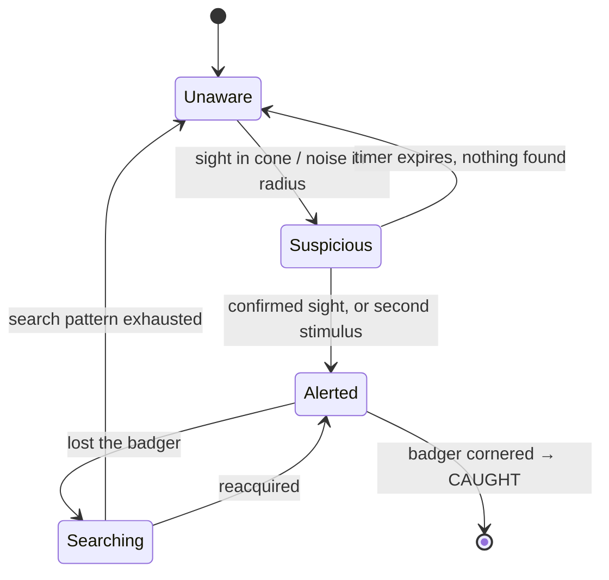

# Badger Blitz — Game Design Document

> Draft 0.1. Opinionated first pass, meant to be argued with.

## 1. The pitch

You are a badger in a British suburban cul-de-sac. Every night you leave the sett,
work the gardens and bins of Hedgefield Close, sneak into houses through cat flaps,
and drag home whatever you can carry before dawn. The neighbourhood learns. It gets
harder. Winter is coming and you have cubs to feed.

*Untitled Goose Game*'s tone, a light heist loop, and a stealth game where the whole
map is somebody's back garden.

**One-line hook:** the badger's body is the puzzle — fat, strong, low, brilliant nose,
terrible eyes, and it does not fit back out of the window holding a whole Bakewell tart.

## 2. Format

Top-down, real-time, single player, runs in a browser.

The concept art is a cinematic side-on shot. Moving to top-down keeps the mood and
throws away the camera. What survives and what changes:

| Concept art | Top-down translation |
| --- | --- |
| Night palette, warm light spilling from a kitchen | Kept, and promoted to a *mechanic* — see §5 |
| HUD layout (objectives TL, night/rep TC, stash TR, minimap BL, stats BC) | Kept almost verbatim; it all still reads top-down |
| Badger seen in profile through a doorway | 8-direction sprite or rotating billboard, seen from above |
| House interior visible past the door | Roof-fade: enter a building and its roof dissolves, revealing the room (GTA 1/2, *Hotline Miami*) |
| Fixed cinematic framing | Camera pulls out in open gardens, pushes in indoors |
| "Risk level: low" | Per-house heat, decays over nights |

The roof-fade is the moment the concept art captures, just from above. That transition —
garden dark and wide, then the roof peels back and you're in a bright cramped kitchen with
a dog asleep two rooms away — should be the signature shot of the game.

## 3. Core loop

**Per night (8–12 minutes real time):**

1. **Sett** — review objectives, spend last night's haul, pick a rough route on the map.
2. **Out** — dusk. The clock arc starts. Humans are still up.
3. **Forage** — bins, compost, lawns, allotments, feeding stations, and eventually houses.
4. **Get out** — carrying loot changes what you can do. Getting *in* is easy; getting out
   with the tart is the puzzle.
5. **Dawn** — hard timer. Anything not in the sett or a cache is lost.
6. **Tally** — feed cubs, bank shinies, notoriety shifts, the neighbourhood adapts.

**Per campaign (~30 nights):** autumn into winter. Natural food thins out, hunger drains
faster, and you're pushed from harmless garden foraging into genuine burglary. The arc is
a slow escalation from *charming local wildlife* to *the thing the neighbourhood WhatsApp
group is very worried about*.

## 4. The three meters

Straight from the concept art, made load-bearing.

**Hunger** — drains all night, faster when sprinting or digging. Eat to top it up.
Every item is a decision: *eat this now, or carry it home for the cubs?* That single
tension does more work than any other rule in the game. Food eaten is stamina; food
carried is progress.

**Stamina** — the budget for sprinting, digging, barging and the scent pulse. Regenerates
when you stand still, faster on soft ground and in cover. Sprinting is how you escape and
it is also loud, so stamina is really "how many mistakes can I afford".

**Sneak** — not a resource, a *live readout*. It's a computed detectability score shown as
a bar: speed + surface + light + cover + how much you're carrying. Green means nothing has
noticed you. It drops the instant you step off grass onto gravel under a security light.
It is the stealth UI, and it teaches the light and surface rules without a tutorial.

## 5. Light, sound and surface

Three physical systems, all readable at a glance, all top-down.

**Light.** Real 2D shadow casting. Window spill, security floodlights on PIR timers,
street lamps, torches, car headlights sweeping the road, the fridge door you just opened.
Dark is safe, lit is not, and shadows move. This is why the game wants a real lighting
pass rather than a painted-on one — see the tech plan.

**Sound.** Surfaces have a noise value: grass silent, soil quiet, gravel loud, decking
hollow, kitchen lino squeaky, a bin lid catastrophic. Noise propagates as an expanding
radius, attenuated by walls. NPCs hear it. So should the player — you should hear the dog
before you see it, and audio design is a mechanic here, not decoration.

**Scent.** Held (Space), costs stamina, pulses out and reveals: food through walls,
dog scent trails, other badgers' markers, your own buried caches, and roughly where the
humans are. It's the badger's compensation for terrible eyesight, and it's the map-reading
verb. Render it as a radar-ish pulse that fades, not a permanent overlay.

## 6. Verbs

The concept art gives three abilities. I'd ship five.

- **Sneak** (hold Shift) — half speed, near-silent, low profile. Costs time, and time is
  the real currency.
- **Dig** (E on soil) — under fences, into compost heaps, into lawns for worms and grubs,
  and to bury caches. Slow and loud. **Digs persist between nights**, so you are literally
  re-shaping the map into a private road network across the campaign. This is the best idea
  in the document; protect it.
- **Scent** (hold Space) — as above.
- **Barge** — you weigh 12kg and you are mostly shoulder. Knock over a bin, shoulder a
  wobbly gate, break a rotten fence panel, shove a cat. Very loud, costs stamina. The
  panic button and the route-opener.
- **Carry** — one large item in your jaws, plus a few small ones. Carrying large kills
  sprinting and blocks small gaps. Drop (C) is therefore a real tactic: ditch the tart,
  outrun the dog, come back for it.

## 7. Loot and the stash

The concept art's stash — tart ×1, spoon ×22, key ×1 — implies three categories, which is
exactly right.

**Food** — the point. Tiered mostly as a joke:

| Tier | Examples |
| --- | --- |
| Common | Earthworms, windfall apples, slugs, birdseed |
| Uncommon | Bin chicken, a bag of cat biscuits, half a kebab |
| Rare | A whole sausage, a block of cheddar, the good dog food |
| Epic | **Bakewell tart** |
| Legendary | The Christmas ham. The prize marrow from the allotment. |

**Shinies** — spoons, keys, jewellery, foil, hi-vis strips. No direct use, which is the
point: they're trade goods for the Magpie (§8), and they're the reason you take the extra
risk after you've already got what you came for.

**Key items** — that key opens something. Sheds, greenhouses, the allotment gate, a garage.
Persistent unlocks hidden in the loot table.

**Caches.** Dig anywhere, bury loot, come back for it. Retrieve with Scent. Foxes can find
and rob them. This turns the map into a savings account with a break-in risk, and gives
Dig and Scent a reason to exist together.

## 8. Cast

Nothing here is a health bar. Everything is an alarm, an obstacle, or a negotiation.

- **Cat** — territorial, can't hurt you, will absolutely scream and wake the house.
  Bribable with food. The cat flap is its door and it resents you using it.
- **Dog** — chases, barks, garden- or house-bound. The real threat. Knows your smell after
  the first encounter.
- **Fox** — rival forager, recurring character. Robs your caches, competes for the same
  bins, occasionally leads you somewhere good. Antagonist you grow fond of.
- **Hedgehog** — harmless, chatty, gives tips about the street. (Real badgers eat hedgehogs.
  This one does not. The game is warm.)
- **Humans** — per-house schedules and personalities. The insomniac at No. 3 who watches
  telly till 2am. The night-shift nurse whose car headlights sweep the close at 04:10.
  The kid with a torch. **Mrs. Pemberton at No. 14**, who leaves food out for you on
  purpose and whose garden is therefore sacred.
- **The Magpie** — trades shinies for information. Marks a fridge on your map, tells you
  which house has the dog out tonight, sells you a route. Gives shinies a purpose and gives
  the player a way to buy down risk.
- **Wildlife officer** — late-game escalation, arrives when notoriety is high, sets humane
  traps. Not a threat to your life, a threat to your *stash and your street*.
- **Clan badgers** — later feature: send sett-mates on their own routes while you work a
  different garden. A light management layer for the back half of the campaign.

## 9. Detection

Three-state awareness per NPC. Deliberately legible.

Suspicious NPCs walk to the last known position and look around. Alerted ones chase, shout,
switch lights on, and — critically — **escalate the house**, which persists.

**Failure is "caught", not "dead".** Cornered means you're bagged, relocated, and you lose
the night and your carried loot. Notoriety spikes. That's a bad night, not a reload prompt.
The only true game over is the cubs starving, which takes sustained failure to reach.

Chases should be *fun*. Sprint, barge through a fence panel you weakened three nights ago,
drop into a dug tunnel, vanish. Every escape should feel like it used something you built.

## 10. Notoriety and heat

Two numbers, one visible.

**House heat** (the concept art's "RISK LEVEL") — per-house, rises when you're seen or
when they find the mess, decays over several nights. Hit the same fridge twice in a week and
that house wakes early, leaves the landing light on, and locks the cat flap.

**Notoriety** (the concept art's paw meter) — street-wide, the campaign's difficulty dial.
It ratchets the neighbourhood's countermeasures:

| Notoriety | The close responds |
| --- | --- |
| 1 | Nothing. You're a nice bit of local wildlife. |
| 2 | Bin bungees. Someone's put a brick on a lid. |
| 3 | Motion-sensor floodlights on two houses. |
| 4 | Lockable cat flaps. A neighbour patrols with a torch. |
| 5 | Wildlife officer, humane traps, a Facebook group with a name. |

Notoriety decays if you lie low, which makes "do a quiet night on worms and windfalls" a
genuine strategic option rather than a waste of time.

*Open question:* the concept art's meter is green and reads positive, so it may have been
intended as standing among badgers rather than infamy among humans. I've made the visible
meter Notoriety because it's the one that changes the game as it moves, and kept **Sett
Standing** as the invisible progression currency. Worth confirming which you meant.

## 11. The map

**Handcrafted and persistent, not procedural.** The entire pleasure is learning Hedgefield
Close — knowing which fence panel is loose, which garden has the dog, that the gap behind
No. 9's shed comes out by the compost heap. Procedural generation would destroy exactly
the knowledge the game is about accumulating.

Roughly 10–12 houses around a cul-de-sac, each with front garden, back garden, and an
interior gated behind a cat flap, an open window, a dog flap, or a back door someone forgot.

Shared spaces: the road (cars are the one genuinely lethal thing), the green, the
allotments, a building site, the churchyard, the chippy bins at the top of the road
(jackpot, floodlit, terrible idea), a stream culvert running under the estate.

**The hedgerow highway.** An unbroken corridor of hedge, verge and fence-line running
around the edge of the map. Completely safe, and slow. Cutting across open lawns and the
road is fast and exposed. Every route is that trade, and your dug tunnels are how you buy
shortcuts through it permanently.

**Persistent world state:** dug holes, broken fence panels, robbed houses, discovered
locations, caches, per-house heat, which dogs know your smell.

## 12. Variety without procedural generation

The map stays the same. The *night* changes.

Bin day (wheelie bins out on the pavement — a feast, in the open). Bonfire night (fireworks
mask your noise, terrify every dog on the street). A party at No. 7. Storm (rain kills
scent trails, both yours and theirs). Full moon (everything is lit). Frost (loud ground,
no worms). Christmas (the ham). A new family moves into No. 2 and you know nothing about
their habits.

Roughly one modifier per night, drawn against the calendar. This is where the campaign's
texture comes from.

## 13. Progression

- **Sett upgrades** — extra chambers (stash capacity), fresh bedding (stamina regen),
  a second entrance (a safe exit on the other side of the map), a cub chamber.
- **Badger traits** — bigger jaws (carry two large), quieter paws, faster digger,
  iron stomach (eat spoiled food safely), better night vision.
- **Knowledge as progression** — once you've smelled a fridge, it's on your map forever.
  Much of the power curve is the player's own head, and the map reflects it.
- **Routes** — your tunnel network *is* your build.

## 14. Tone

Warm, wry, and extremely British. The concept art's tip box already has the voice
("Use cat flaps to sneak into houses unnoticed"). Nature-documentary narration over
suburban pettiness. Names that sound like a parish newsletter. The Bakewell tart treated
with the reverence of a legendary artifact.

The one thing to be careful with: the badger cull is a live political argument in the UK.
I'd keep it entirely out of the mechanics and let the wildlife officer be an inconvenience
with a humane trap, not a statement.

## 15. Controls

Straight from the concept art, adapted.

| Input | Action |
| --- | --- |
| WASD / arrows / left stick | Move |
| Shift (hold) | Sneak |
| Space (hold) | Scent |
| E | Interact — open, squeeze, dig, take |
| C | Drop carried item |
| Q | Barge |
| Tab | Map |

Gamepad throughout. Mobile is genuinely viable — top-down with five verbs maps cleanly to a
virtual stick and three buttons, and a 10-minute night is a perfect mobile session. Worth
designing the HUD for it from day one rather than retrofitting.

## 16. Vertical slice

The smallest thing that proves the game is fun. Build this before anything else.

One night. Three houses on one side of the close. A cat, a dog, and one human who goes to
bed at 23:30. Bins, a hedge run, one soil patch you can dig under a fence. One cat flap,
one fridge, one Bakewell tart. The dawn timer. Return to the sett to win.

If sneaking in, taking the tart, discovering you can't sprint while carrying it, and making
a slow terrified walk home along the hedge line isn't fun on its own, nothing built on top
will fix it.

## 17. Open questions

1. **Notoriety vs. reputation** — which did the paw meter mean? (§10)
2. **Night length** — 8 minutes is tight and replayable; 15 is a proper expedition. Needs
   playtesting, and it determines how big the map should be.
3. **Carry rule** — is "one large item" too restrictive? It's the source of most of the
   tension, so I'd start strict and loosen it only if playtests are boring.
4. **Interiors** — full room-by-room houses, or a single kitchen per house? Full houses are
   far more content for maybe not much more fun.
5. **Cubs** — an actual fail state, or just a scoring pressure? A starvation game over is
   harsh for a game this warm.
6. **Multiplayer** — co-op two badgers is obviously appealing and would roughly double the
   engineering. Explicitly out of scope for v1, but don't architect in a way that forbids it.
